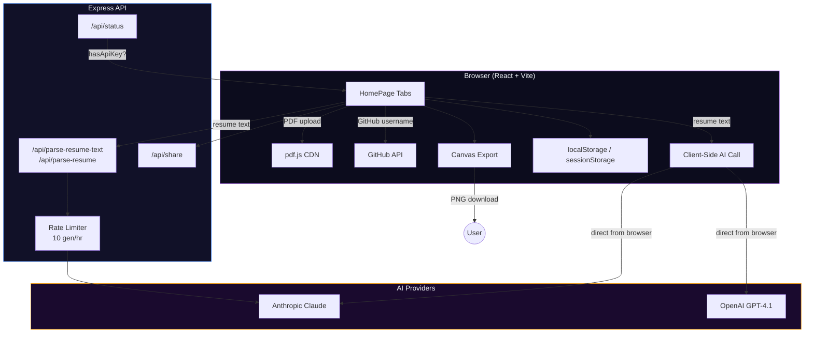
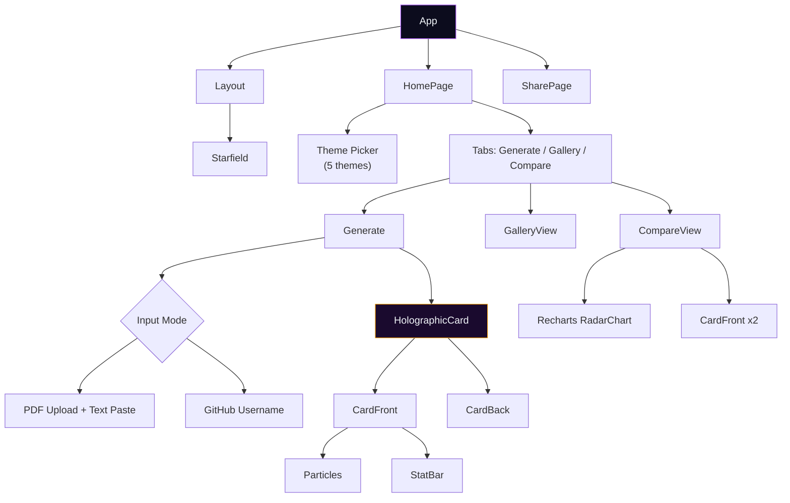
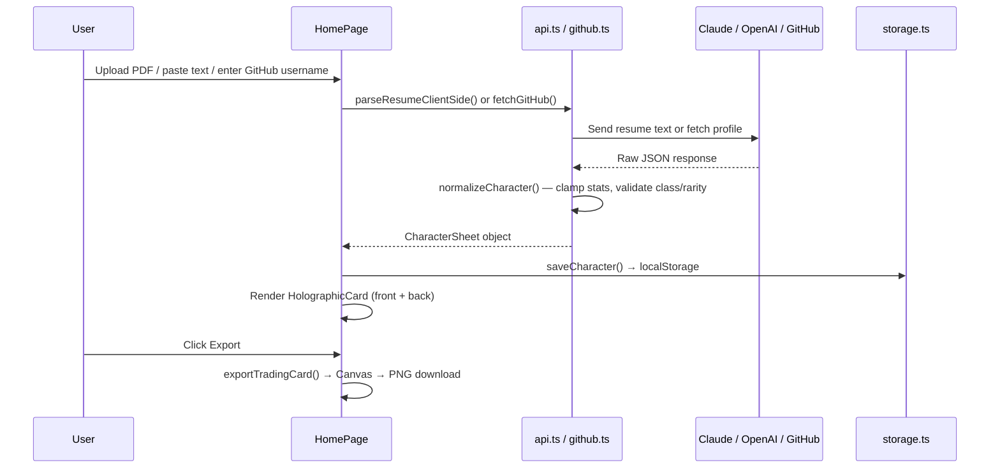

# ⚔️ ResumeRPG

**Transform your resume into a legendary RPG character card.**

Upload a PDF, paste text, or enter a GitHub username — ResumeRPG uses AI to parse your experience into an interactive character sheet with stats, skills, inventory, quests, and a class assignment. Export a physical trading card PNG, share via QR code, or compare two characters side-by-side.

## Architecture

### System Overview



### Two API Key Paths


### Component Tree



### Data Flow: Character Generation



## Features

| Feature | Description |
|---------|-------------|
| **AI Resume Parsing** | Claude Opus 4.6 or GPT-4.1 converts resume text into a structured RPG character |
| **GitHub Mode** | Generate a character from any GitHub username — repos, languages, stars, followers map to stats |
| **5 Visual Themes** | Dark Fantasy, Cyberpunk, Pixel Art, Anime, Corporate — each with unique fonts, colors, and particle effects |
| **3D Holographic Card** | Mouse-tracking tilt with holographic shimmer, click to flip between front (stats) and back (lore/inventory) |
| **Trading Card Export** | 750×1050 PNG with stats, skills, QR code — sized for physical printing |
| **Gallery** | All generated characters saved to localStorage with load/delete |
| **Compare Mode** | Side-by-side radar chart comparison of two characters |
| **Rate Limiting** | 10 gen/hr + 30 share/hr per IP (configurable via env vars) |
| **Bring Your Own Key** | Client-side key stored in sessionStorage, cleared on tab close, calls go direct to provider |

## Power Profile Stats

| Stat | What it measures |
|------|-----------------|
| **IMPACT** | Leadership, team size, business outcomes, scope of responsibility |
| **CRAFT** | Technical depth, education, publications, certifications |
| **RANGE** | Breadth of skills, languages, frameworks, cross-domain versatility |
| **TENURE** | Years of experience, longevity, career consistency |
| **VISION** | Strategic thinking, architecture decisions, domain expertise |
| **INFLUENCE** | Community presence, speaking, open source, awards |

## Project Structure

```
ResumeRPG/
├── server/
│   └── index.js              # Express API — CORS, rate limiter, Claude proxy, Supabase share store, static serving
├── supabase/
│   └── migrations/
│       └── 001_create_cards.sql  # Schema for the cards table (run in Supabase SQL Editor)
├── src/
│   ├── components/
│   │   ├── CardFront.tsx      # Front face — avatar, stats, skills, QR
│   │   ├── CardBack.tsx       # Back face — lore, inventory, quests, boss battles
│   │   ├── HolographicCard.tsx# 3D tilt + flip wrapper
│   │   ├── CompareView.tsx    # Radar chart + side-by-side cards
│   │   ├── GalleryView.tsx    # Saved characters list
│   │   ├── StatBar.tsx        # Animated stat bar (theme-aware)
│   │   ├── Particles.tsx      # Rising particle effects
│   │   ├── Starfield.tsx      # Background star animation
│   │   └── Layout.tsx         # Shell — fonts, animations, theme background
│   ├── lib/
│   │   ├── api.ts             # AI provider calls, system prompt, normalizer
│   │   ├── config.ts          # Themes, class/rarity config, stat names
│   │   ├── export.ts          # Canvas trading card renderer
│   │   ├── github.ts          # GitHub profile → character conversion
│   │   ├── pdf.ts             # Client-side PDF extraction via pdf.js
│   │   ├── share.ts           # QR generation, share encoding
│   │   └── storage.ts         # localStorage persistence
│   ├── pages/
│   │   ├── HomePage.tsx       # Main app — tabs, theme picker, generation flow
│   │   └── SharePage.tsx      # Shared character viewer
│   └── types/
│       └── character.ts       # TypeScript interfaces (CharacterSheet, StatBlock, etc.)
├── railway.json               # Railway deployment config
└── package.json
```

## Quick Start

```bash
npm install
cp .env.example .env          # optionally add ANTHROPIC_API_KEY
npm run dev
```

- **Web:** http://localhost:5173
- **API:** http://127.0.0.1:8787 (proxied as `/api/*` from Vite)

No server API key? The app falls back to "bring your own key" mode — enter an Anthropic or OpenAI key in the UI. Or use GitHub mode, which needs no key at all.

## Production Deployment (Railway)

### 1. Set up Supabase (free tier)

1. Create a project at [supabase.com](https://supabase.com)
2. Go to SQL Editor, paste and run `supabase/migrations/001_create_cards.sql`
3. Copy your project URL and service role key from Settings → API

### 2. Deploy to Railway

1. Push this repo to GitHub
2. Create a new project on [railway.app](https://railway.app) → "Deploy from GitHub repo"
3. Railway auto-detects `railway.json` — it will run `npm ci && npm run build`, then `node server/index.js`
4. Add these environment variables in Railway:

| Variable | Value |
|----------|-------|
| `ANTHROPIC_API_KEY` | `sk-ant-...` |
| `SUPABASE_URL` | `https://yourproject.supabase.co` |
| `SUPABASE_SERVICE_ROLE_KEY` | `eyJ...` |
| `ALLOWED_ORIGINS` | `https://resumerpg.app,https://www.resumerpg.app` |
| `NODE_ENV` | `production` |

5. Railway assigns a URL automatically. Point your domain's DNS to it.

## Scripts

| Script | Description |
|--------|-------------|
| `npm run dev` | Vite + Express API together (dev) |
| `npm run build` | Production client build |
| `npm start` | Production server (serves built client + API) |
| `npm run lint` | ESLint |

## Environment Variables

| Variable | Required | Default | Description |
|----------|----------|---------|-------------|
| `ANTHROPIC_API_KEY` | For real generation | — | Claude API key |
| `SUPABASE_URL` | For persistent links | — | Supabase project URL |
| `SUPABASE_SERVICE_ROLE_KEY` | For persistent links | — | Supabase service role key |
| `ALLOWED_ORIGINS` | In production | — | Comma-separated allowed CORS origins |
| `NODE_ENV` | In production | — | Set to `production` |
| `PORT` | No | `8787` | Server port (Railway sets this automatically) |
| `ANTHROPIC_MODEL` | No | `claude-sonnet-4-6` | Model to use |
| `RATE_LIMIT_GENERATE` | No | `10` | Max generations per IP per hour |
| `RATE_LIMIT_SHARE` | No | `30` | Max shares per IP per hour |

## Tech Stack

**Frontend:** React 19, TypeScript, Vite 6, Tailwind CSS 3, Recharts, pdf.js (CDN)
**Backend:** Express, Anthropic SDK, Supabase, pdf-parse, multer
**AI:** Claude Opus 4.6 (Anthropic) / GPT-4.1 (OpenAI)
**Storage:** localStorage (characters), sessionStorage (API keys), Supabase Postgres (shared cards)

## Roadmap

- LinkedIn OAuth + structured import
- Pixi/Canvas pixel avatar renderer
- Print-ready 2.5×3.5" export at 300 DPI
- Supabase auth and cohort-based rarity
- Public compare links for recruiters

## License

Private / TBD.
