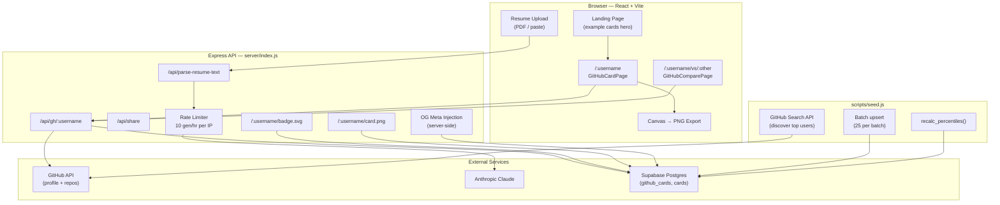
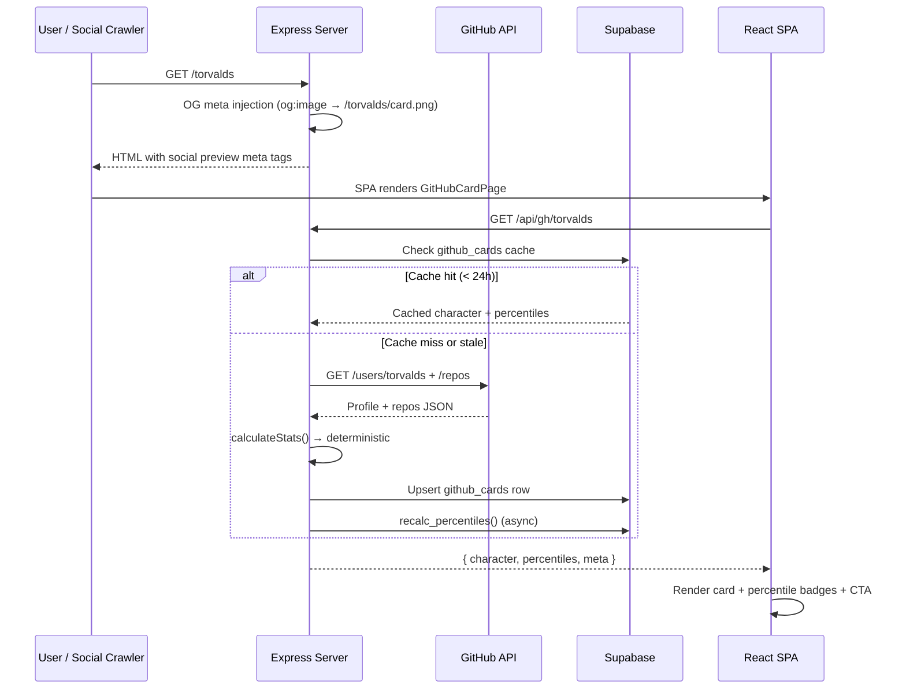

# ⚔️ ResumeRPG

**A developer indexing and ranking platform, disguised as an RPG character card generator.**

ResumeRPG transforms GitHub profiles and resumes into interactive RPG character cards with deterministic stats, percentile rankings across thousands of indexed developers, embeddable README badges, social-preview card images, and head-to-head duel mode. Every GitHub user has a card page at `/:username` — no login, no API key, no friction.

**Live:** [resumerpg-production.up.railway.app](https://resumerpg-production.up.railway.app)

## How It Works

1. **GitHub path (viral):** Visit `/:username` → server fetches profile + repos from GitHub API → deterministic stat calculation → Supabase cache → percentile ranking among all indexed developers. No AI needed.
2. **Resume path (AI):** Upload PDF or paste text → Claude/GPT parses experience into an RPG character sheet → holographic card with export and share.
3. **Seed script:** Bulk-indexes top GitHub developers by follower count for realistic percentile baselines. 10K developers gives "Top 5% of 10,000" — a credible, shareable stat.

## Architecture

### System Overview



### Data Flow: GitHub Card (Viral Path)



### Route Map

| Route | Component / Handler | Description |
|-------|-------------------|-------------|
| `/` | `HomePage` | Landing hero with example cards, theme picker, generate/gallery/compare tabs |
| `/:username` | `GitHubCardPage` | Public GitHub card with percentiles, export, share, duel link, "What's YOUR card?" CTA |
| `/:username/vs` | `GitHubComparePage` | Duel mode input form |
| `/:username/vs/:other` | `GitHubComparePage` | Head-to-head radar chart + side-by-side cards |
| `/share/:id` | `SharePage` | View a shared resume-based card |
| `/privacy` | `PrivacyPage` | Privacy policy |
| `/api/gh/:username` | Express | GitHub card JSON API |
| `/api/gh/:username/vs/:other` | Express | Duel comparison API |
| `/api/gh-stats` | Express | Global cohort stats (total cards, avg power) |
| `/api/parse-resume-text` | Express | Resume → AI → character JSON |
| `/api/share` | Express | Save shared card |
| `/:username/badge.svg` | Express | Embeddable SVG badge for README |
| `/:username/card.png` | Express | PNG card image for social previews |
| `/api/health` | Express | Health check endpoint |

Legacy `/gh/:username/badge.svg` and `/gh/:username/card.png` return 301 redirects to the new paths.

## Features

| Feature | Description |
|---------|-------------|
| **GitHub Cards** | `/:username` — deterministic RPG card from public GitHub data. Cached 24h in Supabase. No AI, no API key needed. |
| **Percentile Rankings** | Stats ranked across all indexed developers. Seed 10K for "Top 5% of 10,000 developers." |
| **Social Previews** | Server-side OG meta injection — sharing a card link on Twitter/Slack/Discord shows the card image automatically |
| **Dynamic Titles** | Browser tab shows `@username — Lv.X ClassName | ResumeRPG` |
| **README Badges** | `/:username/badge.svg` — embeddable badge with level, class, and rarity |
| **Card Images** | `/:username/card.png` — server-rendered PNG via sharp for social preview and export |
| **Duel Mode** | `/:username/vs/:other` — radar chart comparison with shareable results |
| **Viral CTA** | "What's YOUR card?" input on every card page converts viewers into users |
| **Landing Hero** | Homepage shows 3 example cards (Torvalds, Abramov, Sorhus) + cohort count |
| **AI Resume Parsing** | Claude or GPT converts resume text into structured RPG character |
| **5 Visual Themes** | Dark Fantasy, Cyberpunk, Pixel Art, Anime, Corporate — fonts, colors, particles |
| **3D Holographic Card** | Mouse-tracking tilt, holographic shimmer, click to flip front/back |
| **Trading Card Export** | 750×1050 PNG with stats, skills, QR code — sized for physical printing |
| **Gallery** | Saved characters in localStorage with load/delete |
| **Compare Mode** | Side-by-side radar chart comparison of resume-based characters |
| **BYOK** | Client-side API key (sessionStorage) when server has no key configured |
| **Rate Limiting** | 10 gen/hr, 30 share/hr per IP (configurable) |
| **Seed Script** | Bulk-index top GitHub developers for realistic percentile baselines |

## Power Profile Stats

| Stat | Resume (AI) | GitHub (Deterministic) |
|------|-------------|----------------------|
| **IMPACT** | Leadership, team size, business outcomes | Stars, forks, repo count |
| **CRAFT** | Technical depth, education, certifications | Language count, repo count, recent activity |
| **RANGE** | Breadth of skills, cross-domain versatility | Language diversity, multi-language repos |
| **TENURE** | Years of experience, career consistency | Years since oldest repo, repo count |
| **VISION** | Strategic thinking, architecture decisions | Star concentration, top repo quality, bio |
| **INFLUENCE** | Community presence, speaking, awards | Followers, follower/following ratio, company |

Each stat is scored 1–20. Total power (max 120) determines rarity: Common (< 40), Uncommon (40–54), Rare (55–74), Epic (75–94), Legendary (95+).

## Project Structure

```
ResumeRPG/
├── server/
│   ├── index.js              # Express — routes, CORS, rate limiting, OG meta injection, SPA serving
│   └── lib/
│       ├── github-cards.js   # GitHub fetch, deterministic stats, Supabase cache, percentiles
│       ├── badge.js          # SVG badges for README embeds
│       └── card-image.js     # PNG card image via sharp for social previews
├── scripts/
│   └── seed.js              # Bulk GitHub user indexer (discovery → fetch → generate → upsert)
├── supabase/
│   └── migrations/
│       ├── 001_create_cards.sql   # Shared resume cards table
│       ├── 002_github_cards.sql   # GitHub cards table + percentile RPC + stats view
│       └── 003_increment_rpc.sql  # access_count increment helper
├── src/
│   ├── App.tsx               # React Router — /, /privacy, /share/:id, /:username, /:username/vs
│   ├── components/
│   │   ├── CardFront.tsx      # Front face — avatar, stats, skills, QR
│   │   ├── CardBack.tsx       # Back face — lore, inventory, quests, boss battles
│   │   ├── HolographicCard.tsx# 3D tilt + flip wrapper with ResizeObserver
│   │   ├── CompareView.tsx    # Radar chart + side-by-side cards
│   │   ├── GalleryView.tsx    # Saved characters list
│   │   ├── StatBar.tsx        # Animated stat bar (theme-aware)
│   │   ├── Particles.tsx      # Rising particle effects
│   │   ├── Starfield.tsx      # Background star animation
│   │   └── Layout.tsx         # Shell — fonts, animations, theme background, footer
│   ├── lib/
│   │   ├── api.ts             # AI provider calls, system prompt, normalizer
│   │   ├── config.ts          # Themes, class/rarity config, stat names
│   │   ├── export.ts          # Canvas trading card renderer
│   │   ├── pdf.ts             # Client-side PDF extraction via pdf.js
│   │   ├── share.ts           # QR generation, share encoding
│   │   ├── siteUrl.ts         # Canonical URL helper (VITE_PUBLIC_SITE_URL)
│   │   └── storage.ts         # localStorage persistence
│   ├── pages/
│   │   ├── HomePage.tsx       # Landing hero + tabs (generate, gallery, compare)
│   │   ├── GitHubCardPage.tsx # GitHub card + percentiles + CTA + embed snippet
│   │   ├── GitHubComparePage.tsx # Duel mode — radar + cards + CTA
│   │   ├── SharePage.tsx      # Shared character viewer
│   │   └── PrivacyPage.tsx    # Privacy policy
│   └── types/
│       └── character.ts       # TypeScript interfaces (CharacterSheet, StatBlock, etc.)
├── index.html                # Default OG meta tags (replaced server-side per route)
├── railway.json              # Railway deployment config
├── DEPLOYMENT.md             # Production deployment checklist
└── package.json
```

## Quick Start

```bash
npm install
cp .env.example .env          # add keys (see below)
npm run dev
```

- **Web:** http://localhost:5173
- **API:** http://127.0.0.1:8787 (proxied as `/api/*` from Vite)

Use **`npm run dev`** (not `dev:web`) so API routes and `/:username` pages work.

**Supabase is optional locally:** GitHub cards are cached in server RAM without it (no percentile rankings until you add Supabase + migrations 001–003).

**No server AI key?** Resume generation falls back to BYOK in the UI. GitHub cards need **no** AI key (stats are deterministic).

## Seeding the Database

The seed script bulk-indexes top GitHub developers for realistic percentile rankings.

```bash
# Requires GITHUB_TOKEN, SUPABASE_URL, SUPABASE_SERVICE_ROLE_KEY in .env

npm run seed:small     # 1,000 users (~25 min)
npm run seed           # 10,000 users (~4 hours)
npm run seed:resume    # Resume from where you left off
```

**How it works:**
1. **Discovery** — GitHub Search API finds top users by follower count across 28 ranges
2. **Fetch + Generate** — Profile + repos → deterministic character (same logic as server)
3. **Batch upsert** — Every 25 users, upserts into `github_cards` (safe to re-run)
4. **Percentile recalc** — Calls `recalc_percentiles()` at the end

**Safety:** Resumable via `scripts/.seed-progress.json`, auto-sleeps on rate limit, progress reports every 50 users. Use `--dry-run` to test without writing to Supabase.

## Production Deployment (Railway)

See **[DEPLOYMENT.md](./DEPLOYMENT.md)** for the full checklist.

### Short version

1. **Supabase** — Run migrations `001` → `002` → `003` in the SQL Editor
2. **Railway** — Deploy from GitHub; Nixpacks runs `npm ci` then `npm run build`; start runs `node server/index.js`
3. **Env vars** — `NODE_ENV=production`, `SUPABASE_URL`, `SUPABASE_SERVICE_ROLE_KEY`, `ALLOWED_ORIGINS`, `ANTHROPIC_API_KEY`, `GITHUB_TOKEN`, `VITE_PUBLIC_SITE_URL`
4. **Seed** — Run `npm run seed:small` locally to populate the cohort

## Scripts

| Script | Description |
|--------|-------------|
| `npm run dev` | Vite + Express API together (dev) |
| `npm run build` | TypeScript check + Vite production build |
| `npm start` | Production server (serves built client + API) |
| `npm run lint` | ESLint |
| `npm run seed` | Seed 10,000 GitHub developers into Supabase |
| `npm run seed:small` | Seed 1,000 developers (~25 min) |
| `npm run seed:resume` | Resume interrupted seed run |

## Environment Variables

| Variable | Required | Default | Description |
|----------|----------|---------|-------------|
| `ANTHROPIC_API_KEY` | For AI resume parsing | — | Claude API key |
| `SUPABASE_URL` | For production | — | Supabase project URL |
| `SUPABASE_SERVICE_ROLE_KEY` | For production | — | Supabase service role key (server only) |
| `ALLOWED_ORIGINS` | In production | — | Comma-separated allowed CORS origins |
| `NODE_ENV` | In production | — | Set to `production` |
| `PORT` | No | `8787` | Server port (Railway sets this) |
| `VITE_PUBLIC_SITE_URL` | Recommended | — | Canonical `https://` URL for badges, QR codes, OG tags (set before build) |
| `PUBLIC_SITE_URL` | Optional | `https://resumerpg.app` | Server PNG card footer |
| `GITHUB_TOKEN` | Recommended | — | GitHub PAT — 5K req/hr vs 60/hr anonymous |
| `ANTHROPIC_MODEL` | No | `claude-sonnet-4-6` | Model for resume parsing |
| `RATE_LIMIT_GENERATE` | No | `10` | Max generations per IP per hour |
| `RATE_LIMIT_SHARE` | No | `30` | Max shares per IP per hour |

## Tech Stack

**Frontend:** React 19, TypeScript, Vite 6, Recharts, React Router 7, pdf.js (CDN)
**Backend:** Express 4, Supabase JS v2, Anthropic SDK, sharp, multer, pdf-parse
**AI:** Claude Sonnet 4.6 (Anthropic) / GPT-4.1 (OpenAI) — resume path only
**Database:** Supabase Postgres (github_cards with percentile RPCs, shared resume cards)
**Deployment:** Railway (Nixpacks), Supabase hosted Postgres
**Storage:** localStorage (gallery), sessionStorage (BYOK API keys)

## License

Private / TBD.
